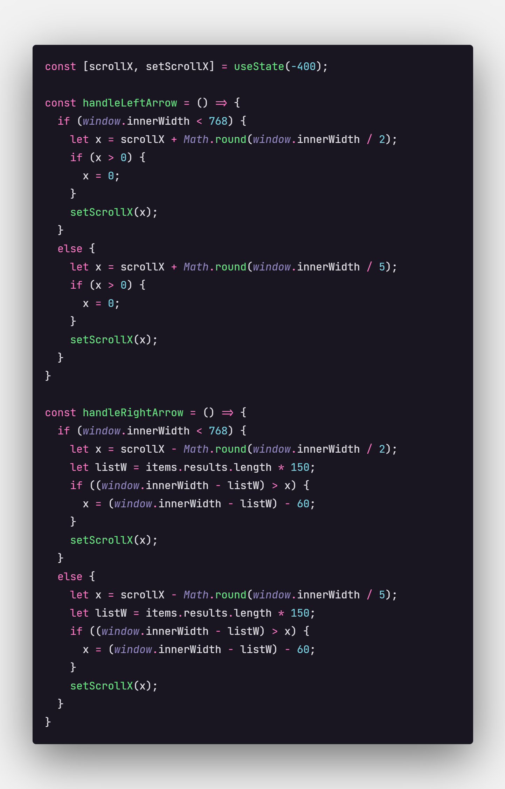

# Netflix Clone 🎬

<!--  -->
<!--  -->

## Table of contents

- [Overview](#overview)
  - [Screenshot](#screenshot-)
  - [Links](#links-)
- [My process](#my-process)
  - [Built with](#built-with-)
  - [What I learned](#what-i-learned-)
  - [Continued development](#continued-development-)
- [Author](#author-%EF%B8%8F)

## Overview

### Screenshot 📷

### Links 🚀

- Live Site URL: [Access here!](http://netflixclone-allbertuu.vercel.app/)

## My process 

### Built with ⚙

- Semantic HTML5 markup
- CSS custom properties
- Flexbox
- Sass preprocessor
- Mobile-first workflow <!-- - MUI React icons lib --> <!-- - [ScrollReveal](https://scrollrevealjs.org/) - JS library -->
- [React](https://reactjs.org/) - JS library

### What I learned 📚

🎉I'm proud of this:  
<!--  -->

> **General development**: 
>- Fetch and control API REST in React.js

#### CSS
- More knowledge about building responsive websites
- Changing the color of elements that has been highlighted by the user
- Elegant animations of elements
#### HTML
- Improvement of my thinking logic in building the website structure right at the beginning of the entire building process  
#### JavaScript
- Handle scroll event
- Controlling the list of movies when the user clicks on both side arrows
#### React.js
- Using map loop for create dynamic elements
- Components with conditional styles

### Continued development 🎯

- Refine my knowledge of create responsive pages

## Author 🙎🏻‍♂️

- Website - [Alberto Albuquerque](https://portfolio-allbertuu.vercel.app/)
- Frontend Mentor - [@allbertuu](https://www.frontendmentor.io/profile/allbertuu)
- LinkedIn - [Alberto Albuquerque](https://www.linkedin.com/in/albertov-albuquerque/)

<table>
  <tr>
    <td align="center">
      <a href="https://www.github.com/allbertuu">
         
        
          <b>Alberto Albuquerque</b>
        
      </a>
    </td>
  </tr>
</table>

[Back to the 🔝](#netflix-clone-) 

