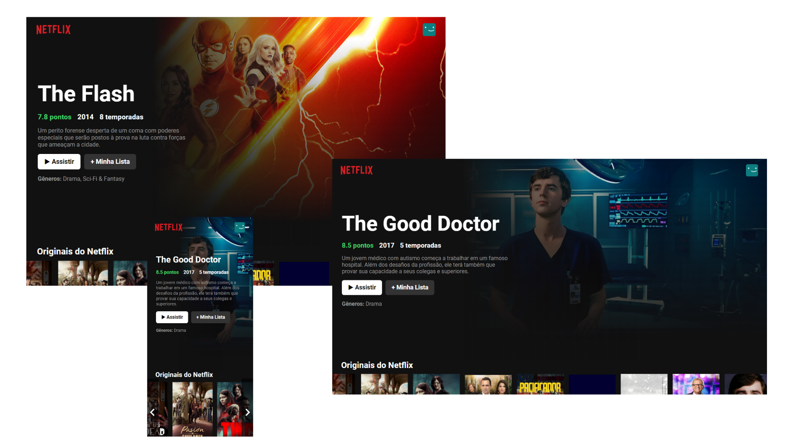

# Netflix Clone 🎬

🚀 [Acesse o site aqui!](http://netflixclone-allbertuu.vercel.app/) 🚀  

## 💬 Sobre o projeto
> Este projeto tem o objetivo de recriar a interface da Netflix, colocando em prática os conhecimentos adquiridos em ReactJS.
>
> Utilizei conceitos de JavaScript e ES6 como: manipulação do DOM, Map (iterações) e manipulação do BOM. Apliquei conceitos de responsividade e flexbox. Voltado ao ReactJS utilizei Hooks, libs, consumo de API REST (web services), useEffect, renderização condicional e state lift.

## 💻 Tecnologias usadas
- ReactJS
- JavaScript ES6
- HTML & CSS

## 📫 Contribuindo para Netflix Clone
Para contribuir com netflixclone, siga estas etapas:

1. Bifurque este repositório.
2. Crie um branch: `git checkout -b <nome_branch>`.
3. Faça suas alterações e confirme-as: `git commit -m '<mensagem_commit>'`
4. Envie para o branch original: `git push origin netflixclone / <local>`
5. Crie a solicitação de pull.

Como alternativa, consulte a documentação do GitHub em [como criar uma solicitação pull](https://help.github.com/en/github/collaborating-with-issues-and-pull-requests/creating-a-pull-request).

## 💡 Feito por

<table>
  <tr>
    <td align="center">
      <a href="https://www.github.com/allbertuu">
         
        
          <b>Alberto Albuquerque</b>
        
      </a>
    </td>
  </tr>
</table>

[⬆ Voltar ao topo](#netflix-clone-) 
